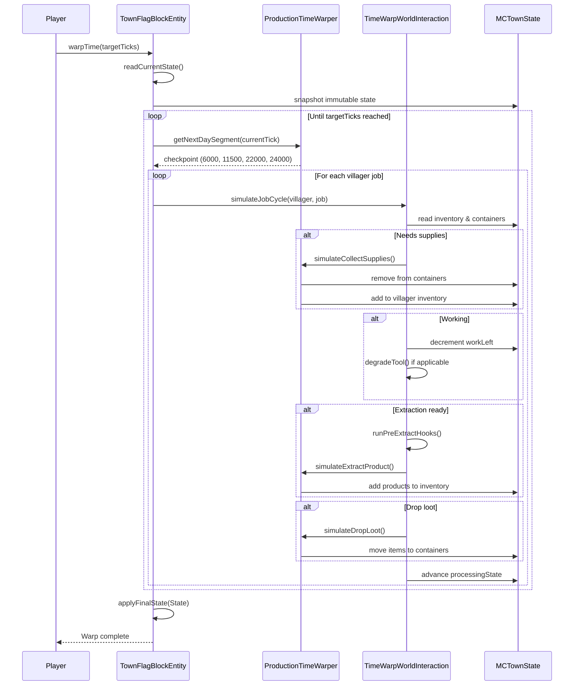
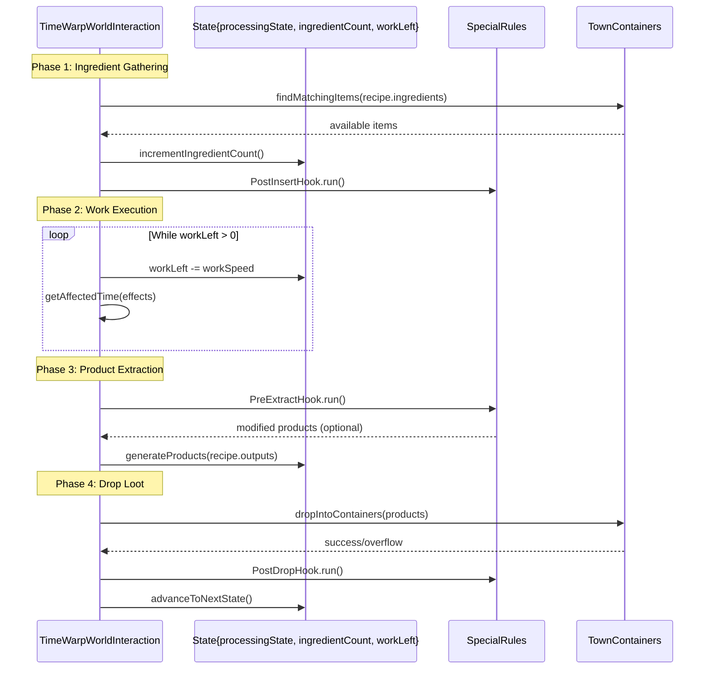
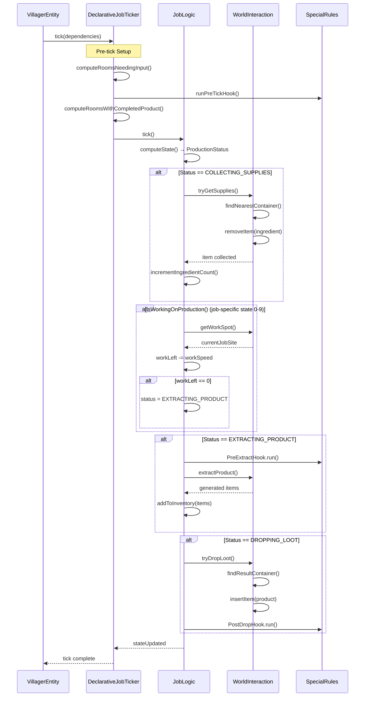
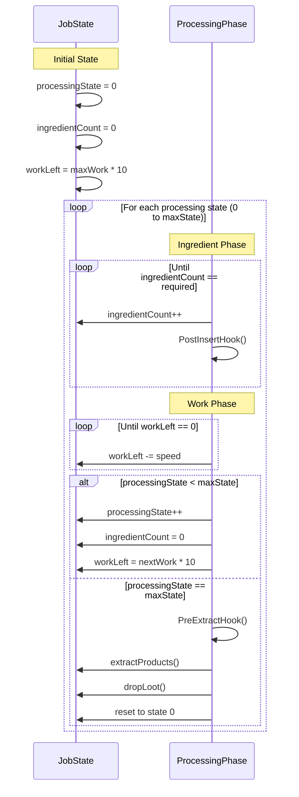
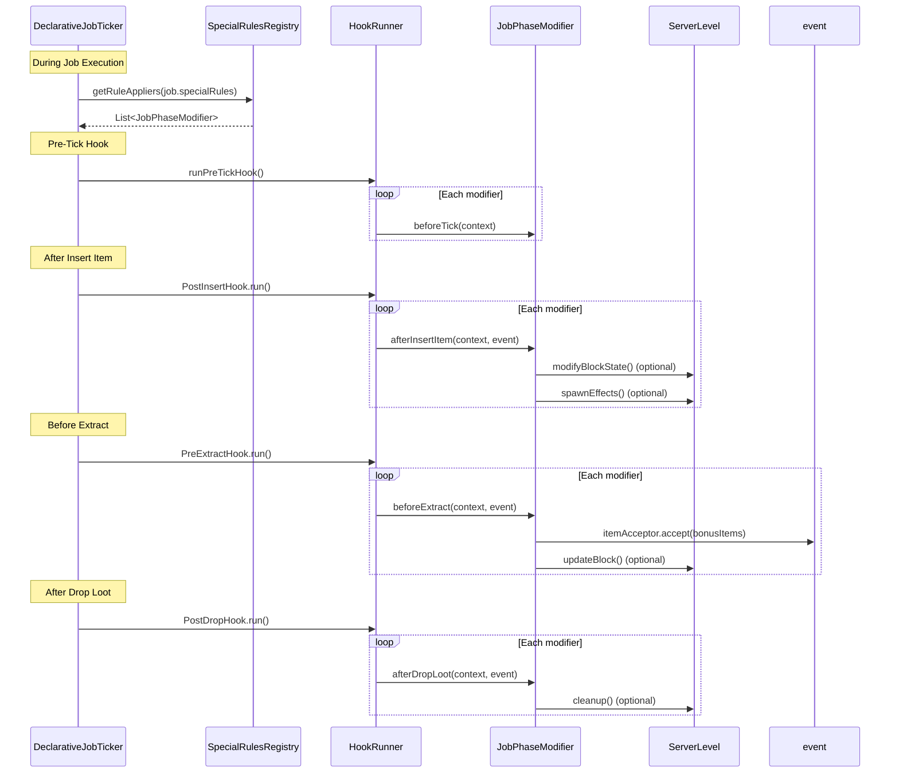
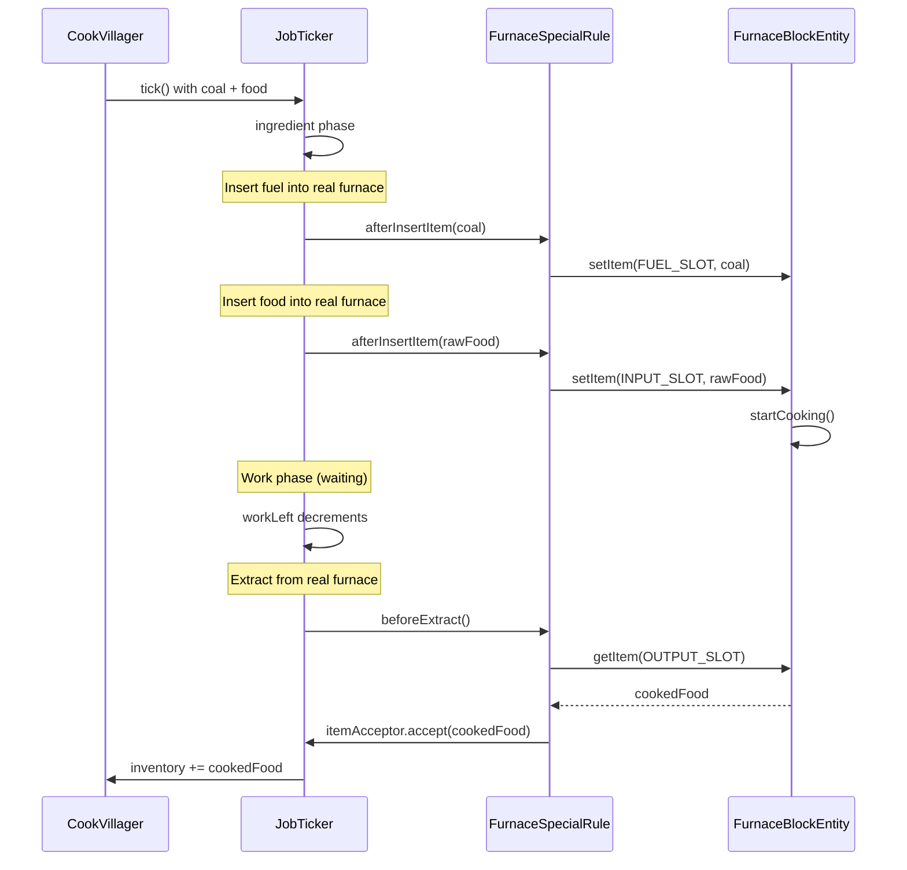
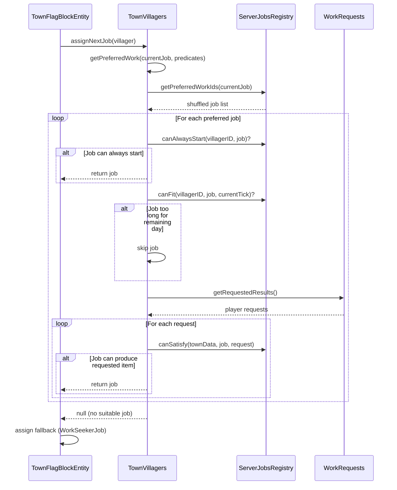
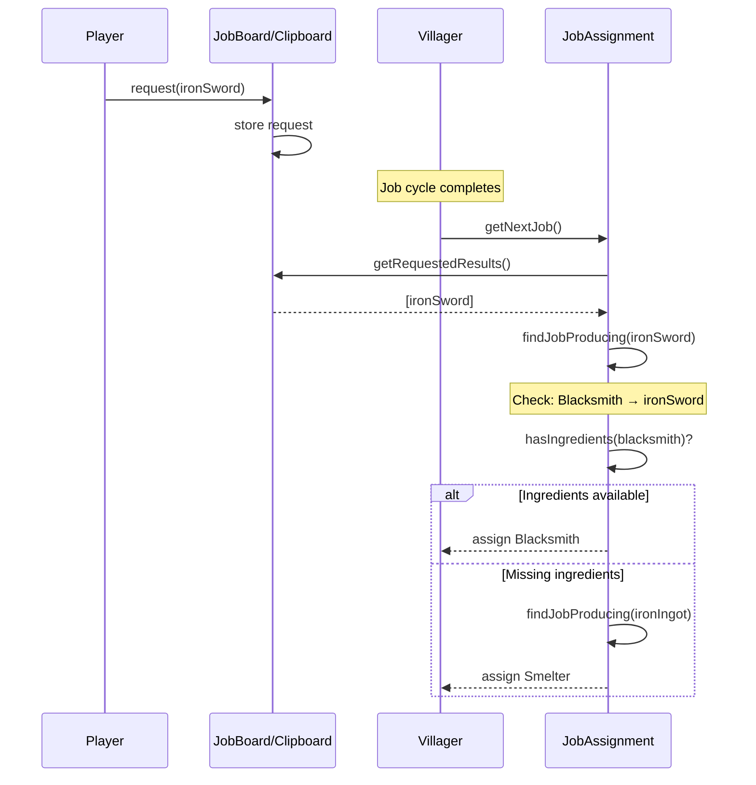
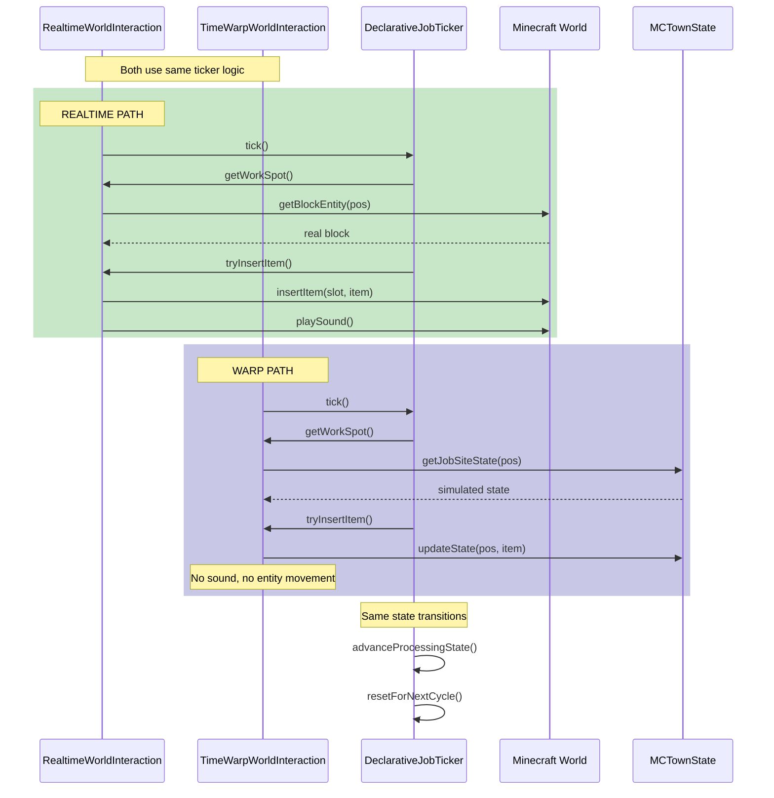

# Questown Sequence Diagrams

This document provides visual explanations of the complex systems in Questown using Mermaid sequence diagrams.

---

## 1. Time Warp System

The Time Warp system simulates villager work during offline progression, allowing towns to advance without keeping chunks loaded.

### Overview: Player Returns After Offline Period

### Detailed: Single Job Cycle During Warp

---

## 2. Declarative Job Ticker (State Machine)

The job ticker orchestrates villager work through a multi-phase state machine.

### Job State Machine Flow

### State Progression Detail

---

## 3. Special Rules / Hook System

Hooks allow jobs to integrate with Minecraft world state beyond the declarative model.

### Hook Invocation Flow

### Example: Cook Job with Furnace Integration

---

## 4. Job Assignment System

Jobs are automatically assigned to villagers based on town needs and player requests.

### Job Selection Algorithm

### Request-Based Job Priority

---

## 5. Realtime vs Warp: Shared Logic Flow

This diagram shows how realtime and warp share the core job logic but differ in world interaction.

---

## Appendix: Key Classes Reference

| System | Class | File Location |
|--------|-------|---------------|
| Time Warp | `ProductionTimeWarper` | `jobs/ProductionTimeWarper.java` |
| Time Warp | `TimeWarpWorldInteraction` | `jobs/declarative/TimeWarpWorldInteraction.java` |
| Job Ticker | `DeclarativeJobTicker` | `jobs/declarative/DeclarativeJobTicker.java` |
| Job Ticker | `DeclarativeJob` | `jobs/DeclarativeJob.java` |
| Hooks | `JobPhaseModifier` | `integration/jobs/JobPhaseModifier.java` |
| Hooks | `PreExtractHook` | `jobs/declarative/PreExtractHook.java` |
| Hooks | `VanillaSpecialRules` | `_vanilla/VanillaSpecialRules.java` |
| Assignment | `TownVillagers` | `town/TownVillagers.java` |
| Assignment | `WorksBehaviour` | `jobs/WorksBehaviour.java` |
