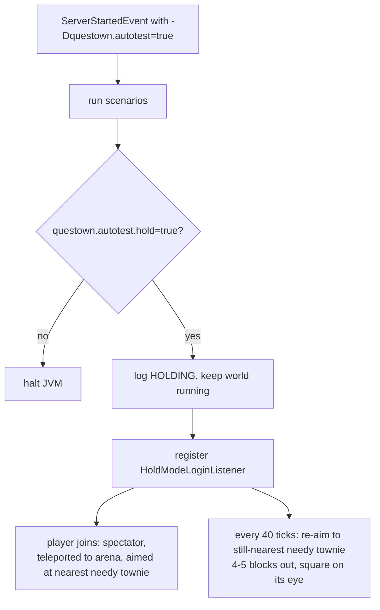

# commands/test — hold mode (visual inspection after a suite)

The autotest harness normally halts the JVM when the last scenario reports
(`/tmp/...log` shows `RESULT: N/N passed`). Hold mode keeps the world alive
afterwards so a dev client can join and *see* the end state — built for
headless screenshot verification (`grim`) of things a unit test cannot judge
(e.g. the need bubbles of ADR-0011).

## Flow

- **Skip the halt** — `AutoTestRunner.HOLD` branch near the end of the tick
  listener. The world keeps ticking; `session.lock` still applies, so kill the
  old held server before launching another `runServer`.
- **Interface** — the `-Pautojoin` Gradle property makes `runClient` connect
  straight to `localhost:25565` (`--server/--port` args), bypassing the title
  screen — no mouse/keyboard needed on the client, which matters because
  dev-box input injection (wtype) does not reach the GLFW window.
- **Aim matters as much as position** — the bubble focus contest is an angular
  cone (dot >= 0.9), so the tracker recomputes yaw/pitch from the villager's
  live position. A fixed yaw goes stale the moment the roster wanders.
- **Hysteresis of scenario state** — need bubbles can clear themselves as the
  world keeps living past the assertions (e.g. a villager eventually finding
  viable work). Verify soon after HOLD, don't sit on the held world for hours.
- Fake players (`[AutoTest]`) are excluded from both the login teleport and the
  per-tick re-aim via the bracketed-name check.
