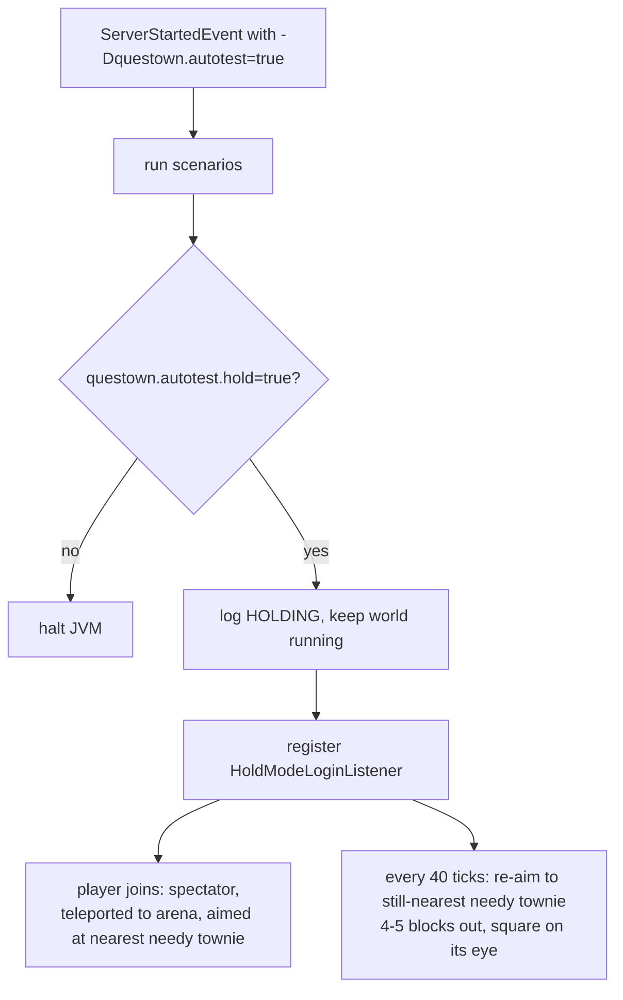

# commands/test — hold mode (visual inspection after a suite)

The autotest harness normally halts the JVM when the last scenario reports
(`/tmp/...log` shows `RESULT: N/N passed`). Hold mode keeps the world alive
afterwards so a dev client can join and *see* the end state — built for
headless screenshot verification (`grim`) of things a unit test cannot judge
(e.g. the need bubbles of ADR-0011).

## Flow

- **Skip the halt** — `AutoTestRunner.HOLD` branch near the end of the tick
  listener. The world keeps ticking; `session.lock` still applies, so kill the
  old held server before launching another `runServer`.
- **Interface** — the `-Pautojoin` Gradle property makes `runClient` connect
  straight to `localhost:25565` (`--server/--port` args), bypassing the title
  screen — no mouse/keyboard needed on the client, which matters because
  dev-box input injection (wtype) does not reach the GLFW window.
- **Aim matters as much as position** — the bubble focus contest is an angular
  cone (dot >= 0.9), so the tracker recomputes yaw/pitch from the villager's
  live position. A fixed yaw goes stale the moment the roster wanders.
- **Hysteresis of scenario state** — need bubbles can clear themselves as the
  world keeps living past the assertions (e.g. a villager eventually finding
  viable work). Verify soon after HOLD, don't sit on the held world for hours.
- Fake players (`[AutoTest]`) are excluded from both the login teleport and the
  per-tick re-aim via the bracketed-name check.
- **Aim preference order** — a scenario may post its own target via the System
  property `questown.autotest.aim.door` ("x,y,z" offset from the arena origin,
  set in a postSpawnAction). When present it wins over needy townies; without
  it, a post-scenario needy townie will steal the aim and the thing the
  scenario asserted on (a dead door, say) may never reach the screen. Used by
  `flag/dead_door_bubbled`.

## Launch discipline (hold mode)

- Env: `JAVA_HOME=$HOME/.gradle/jdks/jdk-17.0.20+8 LANG=C.UTF-8` — the wrong
  JDK breaks Gradle's Groovy compile; a POSIX locale fails javac with
  "unmappable character for encoding US-ASCII".
- Before relaunching: `pkill -f '[G]radlew runClient'`, `pkill -f '[G]radlew
  runServer'`, `pkill -f 'questown[.]autotest'` — always bracket one char or
  the pattern self-matches your own bash argv and kills your shell. A **held**
  server (one launched with `-Dquestown.autotest.hold=true`) **catches SIGTERM
  and survives `pkill`** — after `pkill`, re-check with `pgrep -af '[r]unServer'`
  and `kill -9 <pid>` the java child (the `gradlew` wrapper dies, the server JVM
  does not) if it is still up. Then
  `rm -rf run/world` and confirm port 25565 is free (a surviving held server
  kills the new one with "Address already in use", and holds `session.lock`).
  Note: any `runServer` launch with `-Dquestown.autotest=true` now wipes
  `run/world` itself before boot (gradle `doFirst`), so the manual wipe is
  only needed when relaunching a *non-autotest* server over a locked world.
- Order: server → wait for "HOLDING: server left running" → client
  (`runClient -Pautojoin`). Never join mid-run.
- Before using a Minecraft API in hold-mode/test code, grep an existing call
  site — 1.19.2 lacks several 1.20+ methods (`ServerChunkCache.getLoadedChunks`,
  `Level.getBlockEntities`). Scanning `level.getChunk(cx, cz).getBlockEntities()`
  over the arena works.
