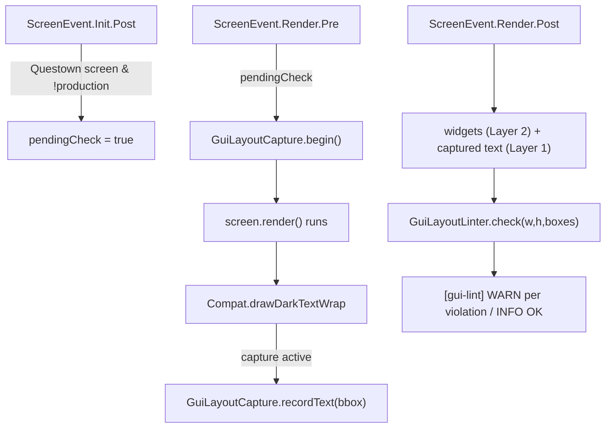

# GUI layout validation + flow layout

Two cooperating pieces: a **layout linter** that flags overlapping/overflowing GUI
elements, and a **flow-layout** screen pattern that avoids producing them. See the
convention doc `docs/solutions/conventions/gui-layout-flow-and-linter.md` for the rules;
this map is the mechanism.

## The linter (dev-only, client)

- **Layer 2** (`collectWidgetBoxes`): widget geometry — off-screen, button-label-overflow.
- **Layer 1** (`GuiLayoutCapture` + the `drawDarkTextWrap` hook): each wrapped-text block's
  real bbox, so text bleeding into another element shows up as an **overlap**.
- Both feed ONE `GuiLayoutLinter.check` (pure, JUnit-tested in `GuiLayoutLinterTest`).
- Runs once per screen open (Init sets a flag; the first Render pair captures + checks).
- Inert in shipped jars (`FMLEnvironment.production`) and never loaded on a server
  (`@Mod.EventBusSubscriber(value = Dist.CLIENT)`). `GuiLayoutCapture` holds no client types
  so the shared `Compat` layer can call it safely.

## Flow layout (FlagCraftingScreen)

`computeLayout()` stacks blocks top-to-bottom, advancing the `y` cursor past each block's
**real** wrapped height (`font.split(text, width).size() * lineHeight + pad`) and sizing the
panel to the total. `init()` (widgets) and `render()` (text) both read the same computed
offsets, so a longer/translated string pushes everything down instead of overlapping —
overlap-proof by construction. This replaced hardcoded Y positions + a 56px wrap width that
overran their rows.
