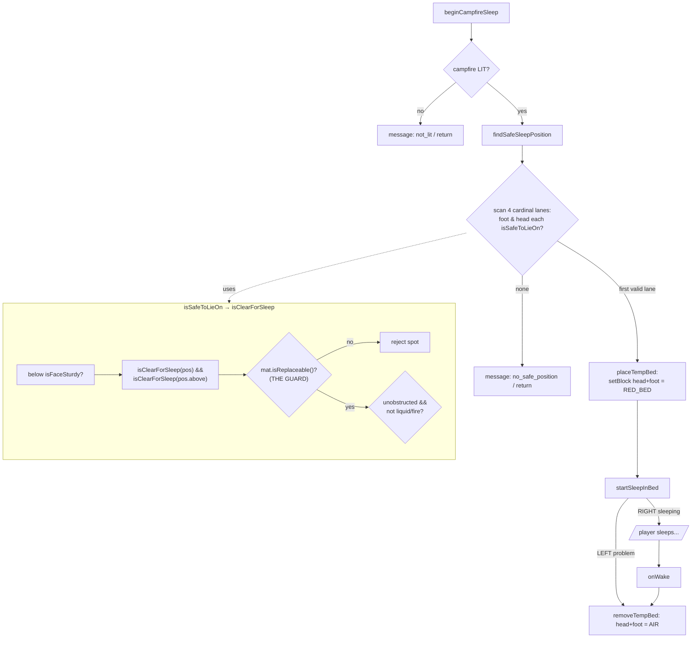
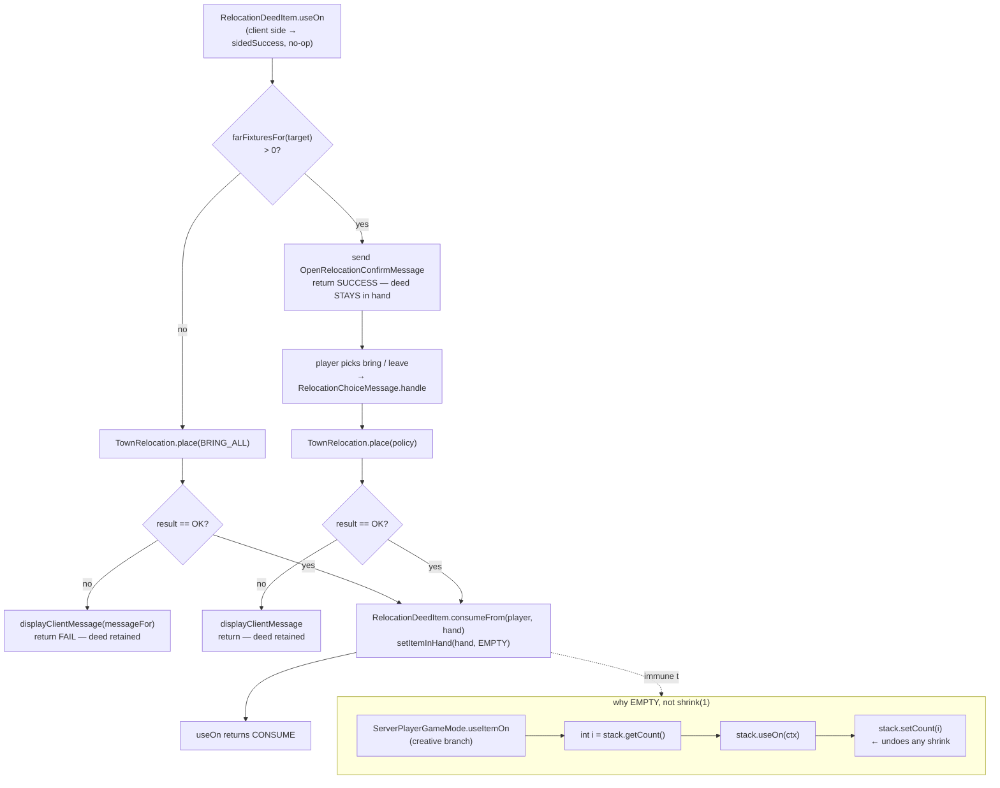

# Campfire sleep — temporary bed lifecycle

`CampfireSleepHandler` lets a player "sleep" at a lit campfire before beds exist
(early tutorial). It fabricates a **temporary red bed**, sleeps the player in it,
and removes it on wake. The subtlety: it mutates world blocks, so it must never
place the bed on top of a real block, or removing the bed deletes that block.

## Why the replaceable guard exists (bug 2026-07-08)

`placeTempBed` and `removeTempBed` are **unconditional** `setBlock`s — place writes
`RED_BED`, teardown writes `AIR`. So a lane is only safe if its head/foot blocks are
air or otherwise replaceable. `isClearForSleep` originally checked only
entity-obstruction + liquid/fire, so a **solid** block (the town flag,
`Material.STONE`) counted as "clear": the bed overwrote the flag — destroying its
`TownFlagBlockEntity` and all town data — and wake-teardown then left `AIR`. The
`!mat.isReplaceable()` early-return closes it: the bed now only ever seats where the
teardown-to-air is correct.

Two conditions must both hold for the bug to bite, which is why it hid in a flat
test arena (see the `flag/campfire_sleep_preserves_flag` autotest):
- The flag lane must be the **first valid** one — an open arena lets the scan pick
  bare ground and dodge the flag.
- The flag must be **entity-free** — a townie standing on it makes `isUnobstructed`
  false, so the buggy check already rejected it. The real bug happened pre-villager.

## Autotest seam

`placeTempBedForTest(level, campfirePos)` runs the real `findSafeSleepPosition` +
`placeTempBed` without the `ServerPlayer`/sleep state machine (headless has no
player). It is the destructive core, so it catches a regression that re-lets the
bed land on a non-replaceable block.

# Relocation deed — placement and consumption

Collecting the deed lives in `town/entity/COMPLEX.md`. This is the other half:
**placing** it, and the non-obvious reason the deed is cleared from the hand
rather than shrunk. A deed that outlives its own placement is a duplication
hazard — it still references the flag that placement just destroyed, so placing
it again mints a second flag for a town that no longer exists.

- **Cancel sends no message at all.** The confirm screen just closes, so the
  "deed stays in hand" branch is also the cancel path — nothing to undo.
- **`setItemInHand(hand, EMPTY)` survives the creative restore** because it
  replaces the *slot*; the game mode's `setCount(i)` then mutates a stack that is
  no longer in the inventory. `shrink(1)` mutates the very stack the game mode is
  about to restore, so in creative the deed comes straight back (the 2026-07-14
  playtest bug). Both placement paths share `consumeFrom` so neither can drift
  back to the shrink idiom.
- **Consumption is strictly after an OK result** — "fail loudly, consume
  nothing". `place` validates fully before mutating, so a non-OK result leaves
  both the world and the deed untouched.

## Autotest coverage

`flag/deed_consumed_on_place` drives the whole real path —
`ServerPlayerGameMode.useItemOn` → `useOn` — with a **creative** Forge
FakePlayer, and asserts deed 1 → 0 plus "nothing dropped on the ground instead".
Creative is essential: in survival the naive shrink passes, so a survival-only
test would have been green against the bug. The other relocate scenarios call
`TownRelocation.place` directly and never touch the item layer.
