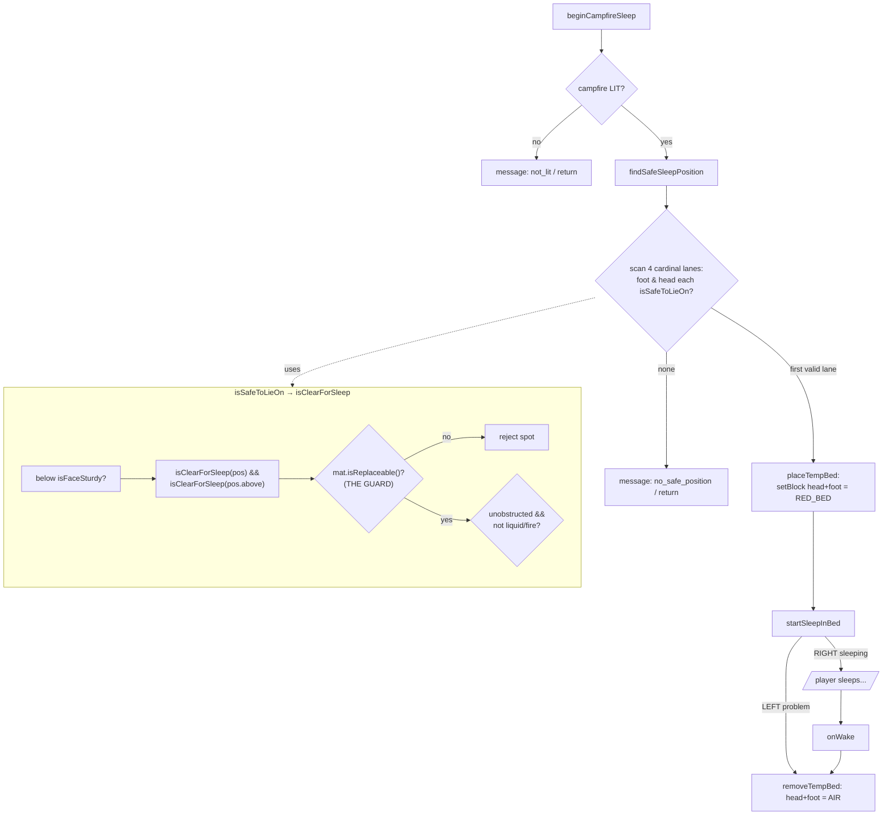

# Campfire sleep — temporary bed lifecycle

`CampfireSleepHandler` lets a player "sleep" at a lit campfire before beds exist
(early tutorial). It fabricates a **temporary red bed**, sleeps the player in it,
and removes it on wake. The subtlety: it mutates world blocks, so it must never
place the bed on top of a real block, or removing the bed deletes that block.

## Why the replaceable guard exists (bug 2026-07-08)

`placeTempBed` and `removeTempBed` are **unconditional** `setBlock`s — place writes
`RED_BED`, teardown writes `AIR`. So a lane is only safe if its head/foot blocks are
air or otherwise replaceable. `isClearForSleep` originally checked only
entity-obstruction + liquid/fire, so a **solid** block (the town flag,
`Material.STONE`) counted as "clear": the bed overwrote the flag — destroying its
`TownFlagBlockEntity` and all town data — and wake-teardown then left `AIR`. The
`!mat.isReplaceable()` early-return closes it: the bed now only ever seats where the
teardown-to-air is correct.

Two conditions must both hold for the bug to bite, which is why it hid in a flat
test arena (see the `flag/campfire_sleep_preserves_flag` autotest):
- The flag lane must be the **first valid** one — an open arena lets the scan pick
  bare ground and dodge the flag.
- The flag must be **entity-free** — a townie standing on it makes `isUnobstructed`
  false, so the buggy check already rejected it. The real bug happened pre-villager.

## Autotest seam

`placeTempBedForTest(level, campfirePos)` runs the real `findSafeSleepPosition` +
`placeTempBed` without the `ServerPlayer`/sleep state machine (headless has no
player). It is the destructive core, so it catches a regression that re-lets the
bed land on a non-replaceable block.
