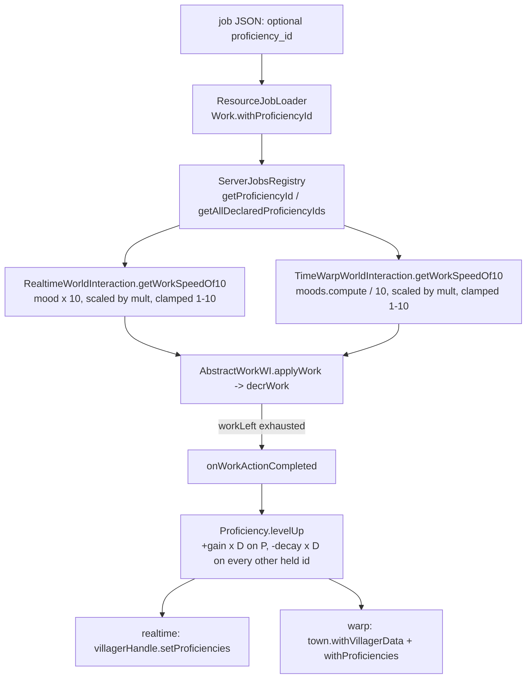
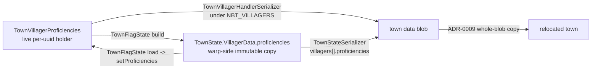
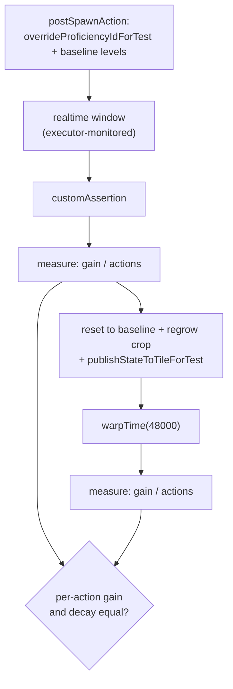

# Job proficiency — a both-paths work-speed multiplier

A per-**townie**, per-**proficiency-id** level in `[0,1]` that scales how fast a townie
completes work. It is applied on the **realtime** path *and* the **warp** path at the one
place they converge, and it levels once per **completed work action**. Design in
`docs/adr/0010-job-proficiency-both-paths-multiplier.md`; vocabulary in `CONTEXT.md`
("Proficiency"). Storage is documented in the second map below, not in `town/`.

**Inert on purpose, not merely incomplete**: no job JSON declares `proficiency_id`, so the
declared-id pool is empty, seeds are empty, and every multiplier is `1×`. It must stay that
way until the speed band is re-centered (last section) — until then, turning the feature on
can only subtract.

## Read + write: one seam, two paths

- Both overrides call the **same** two `RealtimeWorldInteraction` helpers —
  `proficiencyMultiplier` (`Proficiency.multiplierFor(level, MIN, MAX)`; `1×` for a null
  proficiency-id) and `applyProficiencyToWorkSpeed` (the 1–10 clamp, see below) — and that
  sharing is what makes effective speed path-symmetric.
- `D` is the WI's `interval` = job JSON `cooldown_ticks` = `WorkWorldInteractions.actionDuration`.
  Leveling is therefore **per completed action, not per tick**, and warp credits **N actions**
  for free because it re-enters the same `applyWork`.
- **Timer jobs** (gatherer/baker) advance on timed states and never reach `decrWork`, so they —
  and any job without a proficiency-id — are inert **by construction**, with no job-type branch.

## Storage: two lanes, one bridge

- Mirrors the mood/effects split exactly: live holder for realtime, `VillagerData` field for
  warp, `TownFlagState` bridging both directions each warp round-trip. Both lanes persist, and
  the warp-side copy is the one that wins on load — same authority the mood lanes use.
- **Seeding** happens at `TownVillagerHandle.register` (`Proficiency.seed` — UUID-seeded RNG,
  `PROFICIENCY_SEED_COUNT` distinct ids drawn from the declared pool), guarded by `isSeeded`;
  the warp-wake path then **overwrites the seed** with the persisted map, so loaded and
  relocated townies keep their levels.
- **Relocation needs no bespoke code** — both lanes ride the town data blob. The
  `flag/relocate_nearby` autotest stamps a known level pre-move and asserts it post-move
  (check 9), rather than assuming the copy carried it.

## The acceptance gate

`farmer/harvest_wheat [proficiency_parity]` is the ADR-0010 gate: the same work must move
proficiency by the same amount live or offline. Both windows measure the **same villager** —
the executor's realtime window, then an explicit `warpTime` inside the assertion — because the
executor kills and respawns the roster between its own warp and realtime phases, which would
leave the two halves describing different townies.

- Work is counted as **completed actions of proficiency-bearing jobs**
  (`AbstractWorldInteraction.getProficiencyBearingActionsForTest`), not produced items: a
  villager's held stack and a chest stack don't count alike. Normalizing per action is what lets
  two unequal windows be compared — and it is what makes a stale-data bug show up as a
  mismatch rather than as two identical numbers.
- The gate asserts **both paths did non-zero work** before comparing. Without that, zero work on
  either side makes every ratio vacuously equal — the one way this test could pass while
  measuring nothing.
- Three seams exist only for this gate: the proficiency-id override (shipped JSON declares none,
  so the leveling code is otherwise unreachable), the action counter, and
  `publishStateToTileForTest` — warp advances the **tile's stored state**, so a test that mutates
  a villager and warps must publish first or it silently measures the pre-mutation world.
- Two of those seams are **process-global** (a static counter and a static override map), so a
  scenario that left one set would skew the *next* scenario's numbers instead of failing it.
  `TestExecutor`'s constructor clears both. Cleaning on construction rather than teardown is the
  point: a scenario that throws mid-run cannot poison its successor, because the successor
  cleans up before it starts.

## Speed band saturation — the open blocker

`getWorkSpeedOf10` feeds `State.decrWork`, whose contract is **1–10**. The multiplier scales that
number, so the product is clamped by `applyProficiencyToWorkSpeed`. The clamp itself is not
negotiable: without it a well-fed townie past level ~0.33 computes 11+ and throws *inside the warp
loop*, whose handler downgrades the crash into a silently lost visit.

The **saturation** it causes is a defect, not the intended ceiling. Proficiency and mood compete
for the same band: at neutral mood (base 7) the reachable spread is a fair ~4–10, but at max mood
(base 10) every bit of upside is clamped away and only the 0.5× floor remains — so mastery is
worth *less* the better you treat a townie, which inverts what this feature exists to do.
ADR-0010's **Amendment (2026-07-26)** rules on this: re-center the band before any job JSON
declares a `proficiency_id`. Whether that means lowering the well-fed base or widening the
`decrWork` band is deliberately still open there; both have wide balance blast radius.

## Why `getProficiencyId()` defaults to null

`AbstractWorldInteraction.getProficiencyId()` returns null unless overridden, so a *new* subclass
is silently proficiency-inert rather than failing. That is deliberate, and it was re-confirmed
rather than assumed: the default is what keeps JUnit's world-interaction doubles away from
`ServerJobsRegistry`, which they never initialize, and "no proficiency-id" is already a
first-class state here (timer jobs and untagged jobs are inert **by design**) — so null is not an
accident-shaped value in this feature.

The cost is real but small: exactly two production subclasses resolve an id
(`RealtimeWorldInteraction`, `TimeWarpWorldInteraction`), and a hypothetical *third* execution
path that forgot to override would grant a flat 1× forever with nothing failing. Making the method
abstract would not actually prevent that — the path of least resistance in a new subclass is
`return null`, the same silence with a compiler prompt in front of it. The mechanism that *would*
prevent it is a test asserting every concrete production world-interaction resolves its id through
`ServerJobsRegistry`. That is worth adding when content-tagging makes the feature live, not while
it is inert.
