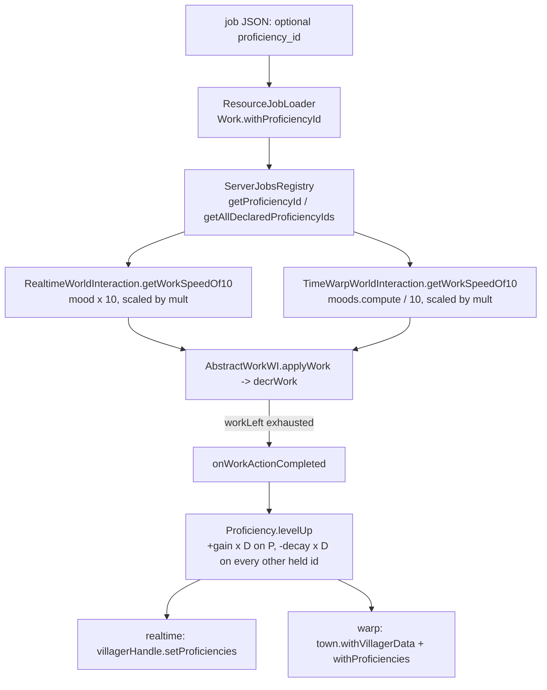
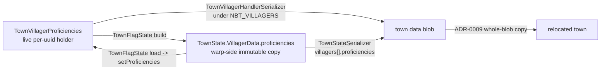

# Job proficiency — a both-paths work-speed multiplier

A per-**townie**, per-**proficiency-id** level in `[0,1]` that scales how fast a townie
completes work. It is applied on the **realtime** path *and* the **warp** path at the one
place they converge, and it levels once per **completed work action**. Design in
`docs/adr/0010-job-proficiency-both-paths-multiplier.md`; vocabulary in `CONTEXT.md`
("Proficiency"). Storage is documented in the second map below, not in `town/`.

**Currently inert**: no job JSON declares `proficiency_id`, so the declared-id pool is
empty, seeds are empty, and every multiplier is `1×`.

## Read + write: one seam, two paths

- Both overrides call the **same** `RealtimeWorldInteraction.proficiencyMultiplier`
  (`Proficiency.multiplierFor(level, MIN, MAX)`), a null proficiency-id yields `1×`, and the
  pre-existing `Math.max(..., 1)` floor is kept — that shared helper is what makes effective
  speed path-symmetric.
- `D` is the WI's `interval` = job JSON `cooldown_ticks` = `WorkWorldInteractions.actionDuration`.
  Leveling is therefore **per completed action, not per tick**, and warp credits **N actions**
  for free because it re-enters the same `applyWork`.
- **Timer jobs** (gatherer/baker) advance on timed states and never reach `decrWork`, so they —
  and any job without a proficiency-id — are inert **by construction**, with no job-type branch.

## Storage: two lanes, one bridge

- Mirrors the mood/effects split exactly: live holder for realtime, `VillagerData` field for
  warp, `TownFlagState` bridging both directions each warp round-trip. Both lanes persist, and
  the warp-side copy is the one that wins on load — same authority the mood lanes use.
- **Seeding** happens at `TownVillagerHandle.register` (`Proficiency.seed` — UUID-seeded RNG,
  `PROFICIENCY_SEED_COUNT` distinct ids drawn from the declared pool), guarded by `isSeeded`;
  the warp-wake path then **overwrites the seed** with the persisted map, so loaded and
  relocated townies keep their levels.
- **Relocation needs no bespoke code** — both lanes ride the town data blob. The
  `flag/relocate_nearby` autotest stamps a known level pre-move and asserts it post-move
  (check 9), rather than assuming the copy carried it.

## Not yet covered

ADR-0010 names a **realtime-vs-warp leveling-parity autotest** as this feature's acceptance
gate. It is not written yet. That is survivable only because the feature is inert — the gate
must land before any job JSON declares a `proficiency_id`.
