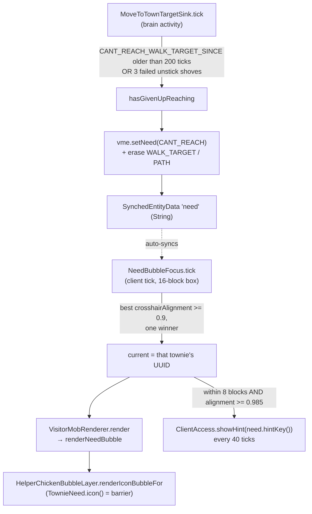
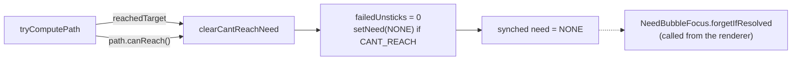
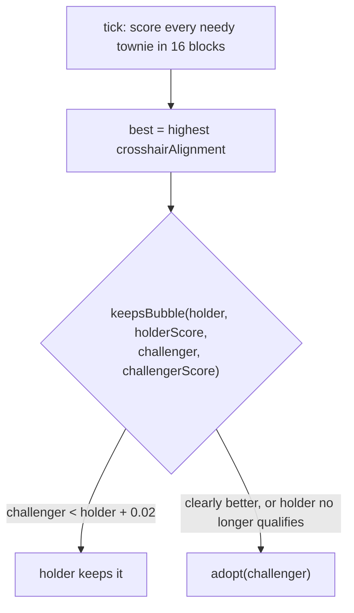

# Need bubbles — from "gave up walking" to an icon over one townie's head

One unmet need (ADR-0011) travels from a brain behaviour on the server to a
world-space bubble on the client. The server decides *that* a townie is stuck; the
client decides *which* stuck townie the player is currently asking about. Neither
half knows the other's rule.

See `CONTEXT.md` → **Need bubble** for the vocabulary, and
`docs/adr/0011-watching-first-and-need-bubbles.md` for why silence-means-working.

## Happy path

- **The give-up is keyed on failure, not elapsed travel.** `Config.WANDER_GIVEUP_TICKS`
  is this behaviour's *maximum duration*, so reusing it would cap healthy long walks
  and abandon townies mid-journey in a large town.
- **The bubble is drawn from `render`, not as a `RenderLayer`** — inside a layer the
  pose is still under body yaw and the icon would spin as the townie turns. This is
  the same reason `HelperChickenRenderer` calls the bubble layer statically.
- **Icon then words, in two gestures**: sweeping the crosshair earns the icon ("who
  needs me"); walking up and looking squarely earns the action-bar line ("what for").
- The bubble renderer lives in `mobs/helperchicken` because that is where it was
  built; it now has a second, non-chicken consumer. Worth moving to a neutral home
  when the third one (the dead-door bubble) lands.

## Exceptional: the need clears itself

- **There is no backoff and no silent re-targeting.** A townie that gave up retries,
  fails, and re-bubbles until the player clears the way — silent self-correction is
  the failure mode the mechanism exists to kill (CONTEXT.md, 2026-07-28).
- Only the server writes `need`; `setNeed` no-ops client-side and on an unchanged
  value, so the synched field is quiet unless something actually changed.
- `failedUnsticks` also resets in `start`, i.e. whenever a fresh path is taken up.
  Without that, a shove count earned against one target would carry to the next and
  make the townie give up on it instantly, before trying.

## Exceptional: two needy townies standing together

- `keepsBubble` is deliberately pure and package-visible so the flicker rule is unit
  tested (`NeedBubbleFocusTest`) without a client level; the cone threshold itself is
  only verifiable in-game.
- Focus state is **static** — there is exactly one local player, and exactly one
  bubble is shown town-wide by design.
