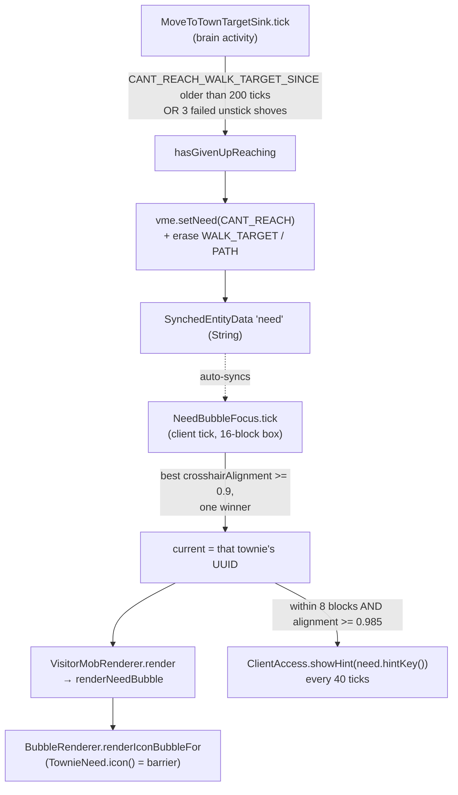
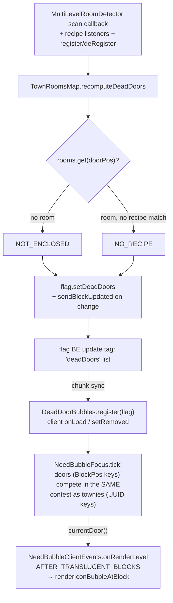
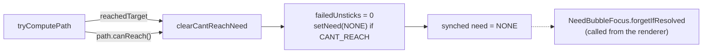
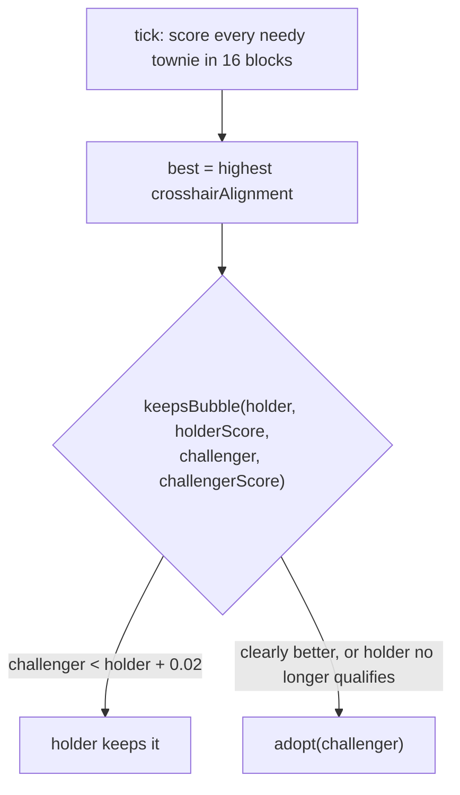

# Need bubbles — from "gave up walking" to an icon over one townie's head

One unmet need (ADR-0011) travels from a brain behaviour on the server to a
world-space bubble on the client. The server decides *that* a townie is stuck; the
client decides *which* stuck townie the player is currently asking about. Neither
half knows the other's rule.

See `CONTEXT.md` → **Need bubble** for the vocabulary, and
`docs/adr/0011-watching-first-and-need-bubbles.md` for why silence-means-working.

## Happy path

- **The give-up is keyed on failure, not elapsed travel.** `Config.WANDER_GIVEUP_TICKS`
  is this behaviour's *maximum duration*, so reusing it would cap healthy long walks
  and abandon townies mid-journey in a large town.
- **The bubble is drawn from `render`, not as a `RenderLayer`** — inside a layer the
  pose is still under body yaw and the icon would spin as the townie turns. This is
  the same reason `HelperChickenRenderer` calls the bubble layer statically.
- **Icon then words, in two gestures**: sweeping the crosshair earns the icon ("who
  needs me"); walking up and looking squarely earns the action-bar line ("what for").
- The bubble renderer was moved to `render/` (from `mobs/helperchicken`, where it was
  first built) once the third consumer (dead doors) landed, since it is now a neutral
  world-space bubble shared by the chicken, townie needs, and dead doors. It is
  `render/BubbleRenderer` — the chicken-specific `renderBubbleFor` path is the only
  method that still takes a `HelperChickenEntity`.

## The second consumer: dead doors

A registered door with no room bubbles too (ADR-0011, grilling 2026-08-09). Doors are
not entities, so the pipeline differs from townies at both ends and meets in the middle:

- **Zombie doors are not bubbles.** If the door *block* is gone, the registration is
  silently discarded on the next tick's block check (ADR-0013) — there is nothing to
  point a bubble at, and a never-completed room cost the player nothing, so there is no
  broadcast either.
- **Both troubles share one door icon** (`DoorTrouble.sharedIcon`); the distinction
  lives only in the close-up words, because the fix differs (walls/roof vs. contents).
- **The sync rides the flag BE update tag**, not a packet. Accepted cost: a player in
  bubble range of a door whose *flag* chunk is not loaded sees no bubble.
- **A door bubbles from the moment it is registered** — the wand-then-fetch-materials
  build flow is *expected* to show a bubble. It diagnoses; it never deregisters.
- The focus holder key is now `Object` (UUID for townies, BlockPos for doors) — the
  hysteresis rule (`keepsBubble`) is type-agnostic and its tests did not change.

## The third consumer: unmet item

When `TownPossibleWork.applyScores` finds **no viable job** for a root, the villagers of
that root are waiting on supplies the town does not have — the mod's worst "looks broken"
moment (ADR-0011). That path already computed the exact missing ingredient for the
economics record; it now also raises the bubble:

- **Set** in `registerUnmetNed` (per-villager, same pass as `econ.registerUnmetNeed`):
  `setNeed(UNMET_ITEM)`.
- **Cleared** in the `applyScores` else-branch (`clearUnmetItemNeeds`): any villager of
  the root whose need is `UNMET_ITEM` goes back to `NONE` the moment a viable job exists
  again. Only `UNMET_ITEM` is cleared — a simultaneous `CANT_REACH` is left alone, and
  `MoveToTownTargetSink.clearCantReachNeed` returns the courtesy (each consumer clears
  only its own need).
- **Icon is the vanilla bundle** (a bag of things to bring), deliberately generic — the
  ADR's "townie under a coal icon" (the *actual* missing item) would need the item ID
  synced per entity; that is a possible follow-up, not part of this slice.
- **The words stay generic for the same reason**: "They don't have the supplies they
  need to work." The `WithReason` prose behind the score is developer-facing and must be
  rephrased before it is ever shown verbatim.
- **Autotest**: `farmer/harvest_wheat [no_supplies]` asserts every townie ends the run
  at `UNMET_ITEM`; the base `farmer/harvest_wheat` asserts the supplied counterpart ends
  at `NONE`. Both ride the existing `CustomAssertion` seam (realtime phase).

## Exceptional: the need clears itself

- **There is no backoff and no silent re-targeting.** A townie that gave up retries,
  fails, and re-bubbles until the player clears the way — silent self-correction is
  the failure mode the mechanism exists to kill (CONTEXT.md, 2026-07-28).
- Only the server writes `need`; `setNeed` no-ops client-side and on an unchanged
  value, so the synched field is quiet unless something actually changed.
- `failedUnsticks` also resets in `start`, i.e. whenever a fresh path is taken up.
  Without that, a shove count earned against one target would carry to the next and
  make the townie give up on it instantly, before trying.

## Exceptional: two needy townies standing together

- `keepsBubble` is deliberately pure and package-visible so the flicker rule is unit
  tested (`NeedBubbleFocusTest`) without a client level; the cone threshold itself is
  only verifiable in-game.
- Focus state is **static** — there is exactly one local player, and exactly one
  bubble is shown town-wide by design.
