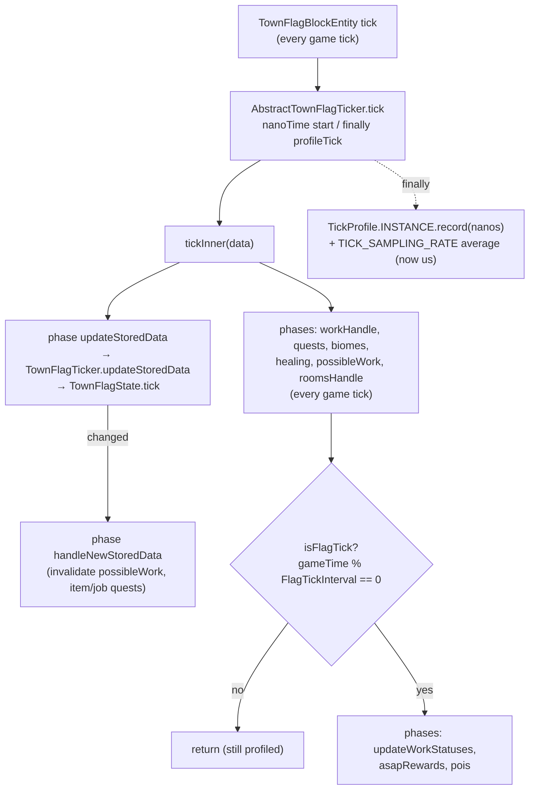
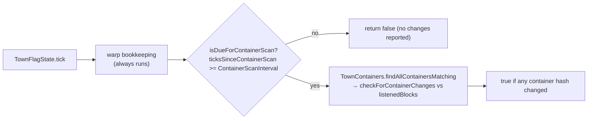
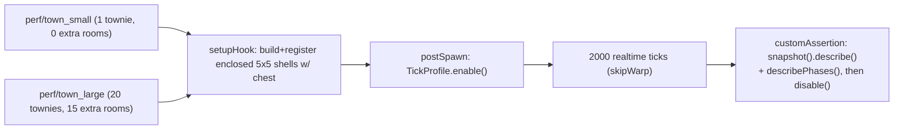
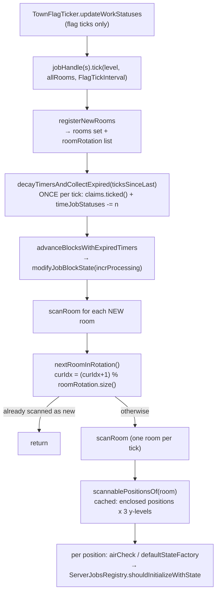
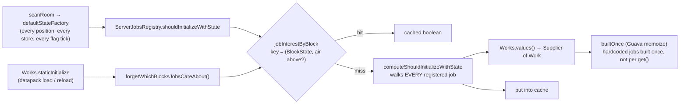
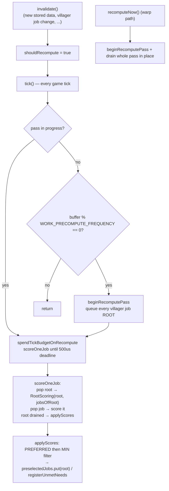

# Flag tick — throttles and profiling

Every town flag ticks on **every** game tick. Two independent throttles decide how
much of the tick actually runs, and `TickProfile` measures what it cost. The
motivating measurement: a flag tick averages ~430us but has a 4.5ms p99 and a
23ms max — a **stutter** problem, not a TPS problem, so the tail is what gets
recorded.

## Happy path

- **Profiling wraps every exit path, not just the full-tick one.** The heavy
  phases are gated behind `FlagTickInterval`, but `updateStoredData` runs on all
  ticks — measuring only full ticks would hide the per-tick cost entirely.
- `TickProfile` is a **disabled-by-default, process-wide singleton**; `enable()`
  is called only by the `perf/*` autotest scenarios, so the production path pays
  one boolean check per phase. Process-wide is deliberate: it is a dev
  measurement tool, and the arena runs one town at a time. If several flags tick
  while it is enabled, their samples fold into the same buckets — which is how
  the cross-run arena residue described in the perf notes shows up as a phase
  sample count that is a multiple of the tick count.
- Timings moved from `System.currentTimeMillis()` to `nanoTime`/microseconds — at
  ms resolution a 400us tick rounds to 0 and a rare spike averages away.

## Container-scan throttle (inside `updateStoredData`)

- The scan walks every recipe-matched room's blocks (chests **and** block
  entities) and hashes contents — ~187us in a 16-room town, ~44% of all tick
  time, and it **grows as the player builds**. It was previously paid above the
  flag-tick throttle, i.e. on every game tick.
- Skipping is safe because detection is a **diff against `listenedBlocks`**, not
  an edge trigger: a chest change during a skipped tick is caught by the next
  scan. Nothing in the town reacts to container contents within the same tick —
  item quests and economics are driven off `handleNewStoredData` — so the only
  visible effect is those reacting up to `ContainerScanInterval` ticks later.
- `ContainerScanInterval` is **independent of `FlagTickInterval`** and expressed
  in game ticks. Both default to 10; that is a coincidence of what each costs,
  not a coupling, and either can be tuned without the other.
- The counter is per-`TownFlagState` (per town), and warp bookkeeping stays above
  the early return so leaving/returning is unaffected by the throttle.

## Measuring it (`perf/*` autotest scenarios)

- These are **measurements, not gates**: the expectation is empty (no products, 0
  cycles), so they always pass and a regression surfaces as a number in the log.
  There is deliberately no p99 threshold — timings on a dev machine under a
  shared arena are too noisy to fail a build on, and a wrong gate would be worse
  than no gate. The signal is the *pair*: small vs large in one run gives the
  scaling shape.
- Each extra room is a self-enclosing shell **with a chest**: a bare shell matches
  no room recipe, and the container scan iterates recipe matches, so without the
  chest the room would not contribute to the cost being measured.
- The report prints the room/townie counts the town *actually* ended up with, so a
  shell that failed to resolve shows up in the measurement instead of silently
  inflating it.

## What the profile found: the `updateWorkStatuses` spike

That phase was the tail — **5314us average**, and the whole flag tick p99 was
14668us. It is now **138us / p99 2704us**. Three separate causes, one of which was
a correctness bug that the profiling exposed rather than a pure cost.

### `AbstractWorkStatusStore.tick` — timers decayed once, rooms scanned in rotation

- **This was a real bug, not just a cost.** The old `doTick` both decayed the
  store-global timers *and* scanned one room, and it was called once per
  newly-seen room — so N rooms appearing in one tick decayed **every** timer in
  the town by `N x ticksSinceLast`. Gatherer day-waits and the leaver `NEED_ROAM`
  tail expired early. `WorkStatusStoreTest.Test_TimerShouldDecayOncePerTick...`
  pins the split: five new rooms in one tick, timer still loses exactly one tick.
- `ticksSinceLast` is the **configured** `FlagTickInterval`, not a measured
  elapsed time. Timers are therefore denominated in "what the config says a flag
  tick is worth"; changing that config mid-world rescales every in-flight timer.
  That predates this change — the fix only makes it the *sole* clock instead of a
  clock multiplied by however many rooms appeared.
- The rotation is a `List` (was `rooms.toArray()[curIdx]`, i.e. a full array
  allocation over a `HashSet` per tick, in an order that was never guaranteed
  stable). The index still advances when the drawn room was already scanned as
  new, so no room is scanned twice and the rotation never stalls.
- A room's enclosed positions never change, so `scannablePositions` computes them
  once per room. The dedupe is a `LinkedHashSet` frozen to an `ImmutableList` —
  order is kept deterministic because scan order decides which cascading block
  wins when two positions map to the same block.
- **Rooms are never removed** from `rooms`, `roomRotation`, or
  `scannablePositions`. That leak predates this change (`rooms` already grew
  forever); the new structures inherit its lifetime rather than adding a new one.
  A demolished room keeps a slot in the rotation, so it costs one wasted scan per
  full rotation — bounded, but it is the thing to look at first if per-tick cost
  creeps back up in a town that has been remodelled a lot.

### Why the per-position job lookup is now cheap

- **The cache key is only valid because of what the predicates read.** Every
  registered `shouldInitializeWorkState` looks at the block state at the position
  and — for `REQUIRE_AIR_ABOVE` — the block above. A predicate that inspects any
  other neighbour silently breaks this and the key must be widened; the javadoc
  on `shouldInitializeWithState` states that contract.
- The answers depend on the *registered jobs*, so the only invalidation is
  `Works.staticInitialize` calling `forgetWhichBlocksJobsCareAbout()` — the one
  place the registry is (re)built, including `/reload`.
- The hardcoded jobs (explorer + 4 gatherer variants) were **method references**,
  so each `values().get()` rebuilt a whole `Work`. A `Work` is an immutable
  description of a job, so it is now built once, like datapack jobs always were.
- The walk it avoids is not small: there is **one cook job per cookable item**, so
  "check every registered job" scales with the item registry — per block
  position, per work-status store, per flag tick.

### `TownPossibleWork` — a recompute pass spread across ticks

- Scoring one job scans the town's containers per job state, and one root can own
  **dozens** of jobs (again: one cook job per cookable item) — a whole pass in one
  tick was the visible hitch. The budget is a hard `500_000` ns and deliberately
  **not** a config value, unlike every other throttle on this map: it is a
  fraction of the fixed 50ms server tick, not a taste knob.
- The budget is checked **between jobs**, so it cannot bound a job that costs more
  than the budget on its own — and one does (~4.6ms max remains). Making a single
  job cheaper means hoisting the town-container scan out of its per-state loop;
  that is the open follow-up, not something this map describes as solved.
- **Warp still drains the pass in one call.** `recomputeNow()` shares
  `beginRecomputePass`/`scoreOneJob` with the incremental path, so both produce
  identical results; warp simply has no ticks to spread across. This is the one
  place the two paths must not diverge — a villager waking up offline picks work
  from the same scores.
- `applyScores` runs **per root as that root finishes**, so mid-pass the
  `preselectedJobs` map is a mix of this pass and the last one. That is safe
  because every read (`getFor`, `nextForVillager`) is keyed by one villager's own
  job root: entries are written whole, per root, and no reader compares two roots
  against each other. An `invalidate()` arriving mid-pass does not restart the
  pass — it re-arms the gate, so the next pass starts after the current one ends.
