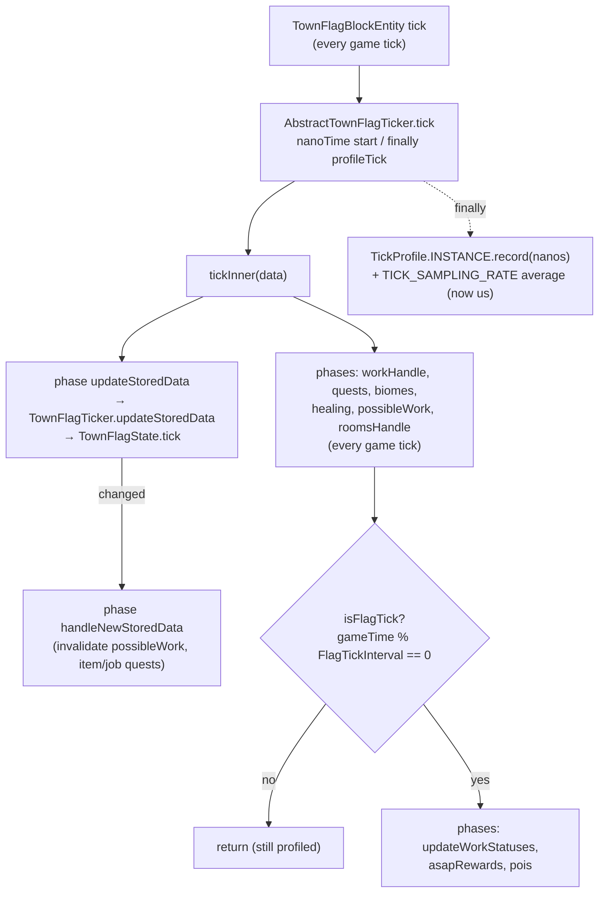
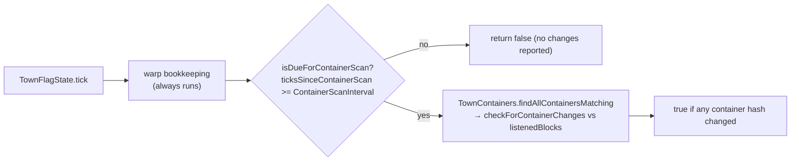
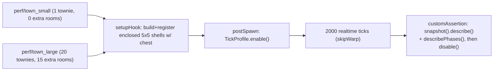

# Flag tick — throttles and profiling

Every town flag ticks on **every** game tick. Two independent throttles decide how
much of the tick actually runs, and `TickProfile` measures what it cost. The
motivating measurement: a flag tick averages ~430us but has a 4.5ms p99 and a
23ms max — a **stutter** problem, not a TPS problem, so the tail is what gets
recorded.

## Happy path

- **Profiling wraps every exit path, not just the full-tick one.** The heavy
  phases are gated behind `FlagTickInterval`, but `updateStoredData` runs on all
  ticks — measuring only full ticks would hide the per-tick cost entirely.
- `TickProfile` is a **disabled-by-default, process-wide singleton**; `enable()`
  is called only by the `perf/*` autotest scenarios, so the production path pays
  one boolean check per phase. Process-wide is deliberate: it is a dev
  measurement tool, and the arena runs one town at a time. If several flags tick
  while it is enabled, their samples fold into the same buckets — which is how
  the cross-run arena residue described in the perf notes shows up as a phase
  sample count that is a multiple of the tick count.
- Timings moved from `System.currentTimeMillis()` to `nanoTime`/microseconds — at
  ms resolution a 400us tick rounds to 0 and a rare spike averages away.

## Container-scan throttle (inside `updateStoredData`)

- The scan walks every recipe-matched room's blocks (chests **and** block
  entities) and hashes contents — ~187us in a 16-room town, ~44% of all tick
  time, and it **grows as the player builds**. It was previously paid above the
  flag-tick throttle, i.e. on every game tick.
- Skipping is safe because detection is a **diff against `listenedBlocks`**, not
  an edge trigger: a chest change during a skipped tick is caught by the next
  scan. Nothing in the town reacts to container contents within the same tick —
  item quests and economics are driven off `handleNewStoredData` — so the only
  visible effect is those reacting up to `ContainerScanInterval` ticks later.
- `ContainerScanInterval` is **independent of `FlagTickInterval`** and expressed
  in game ticks. Both default to 10; that is a coincidence of what each costs,
  not a coupling, and either can be tuned without the other.
- The counter is per-`TownFlagState` (per town), and warp bookkeeping stays above
  the early return so leaving/returning is unaffected by the throttle.

## Measuring it (`perf/*` autotest scenarios)

- These are **measurements, not gates**: the expectation is empty (no products, 0
  cycles), so they always pass and a regression surfaces as a number in the log.
  There is deliberately no p99 threshold — timings on a dev machine under a
  shared arena are too noisy to fail a build on, and a wrong gate would be worse
  than no gate. The signal is the *pair*: small vs large in one run gives the
  scaling shape.
- Each extra room is a self-enclosing shell **with a chest**: a bare shell matches
  no room recipe, and the container scan iterates recipe matches, so without the
  chest the room would not contribute to the cost being measured.
- The report prints the room/townie counts the town *actually* ended up with, so a
  shell that failed to resolve shows up in the measurement instead of silently
  inflating it.
