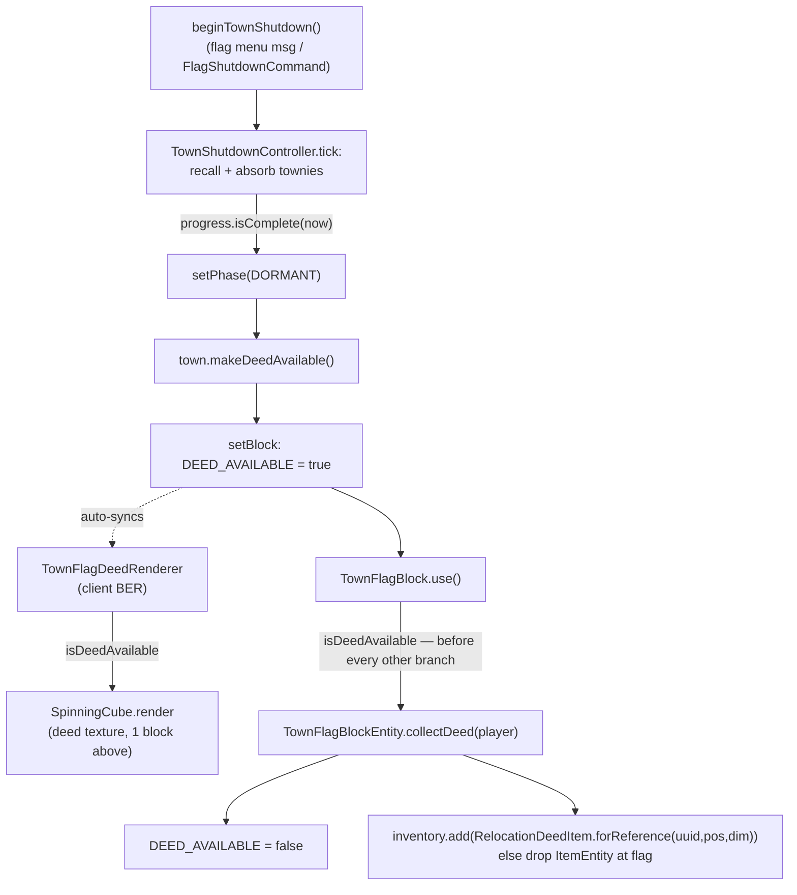
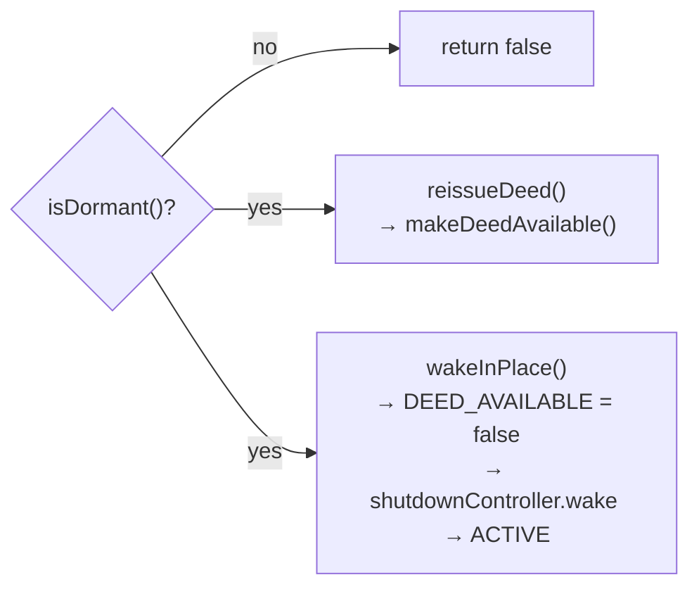
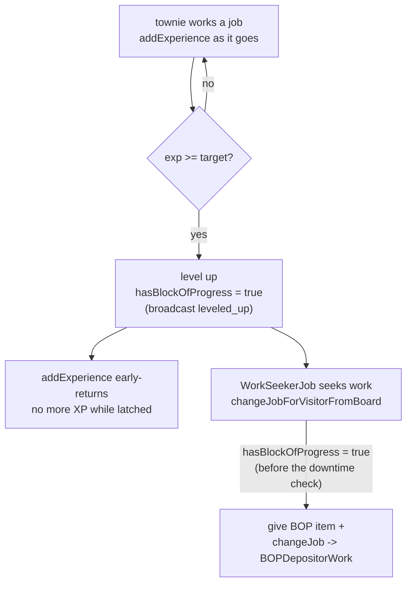
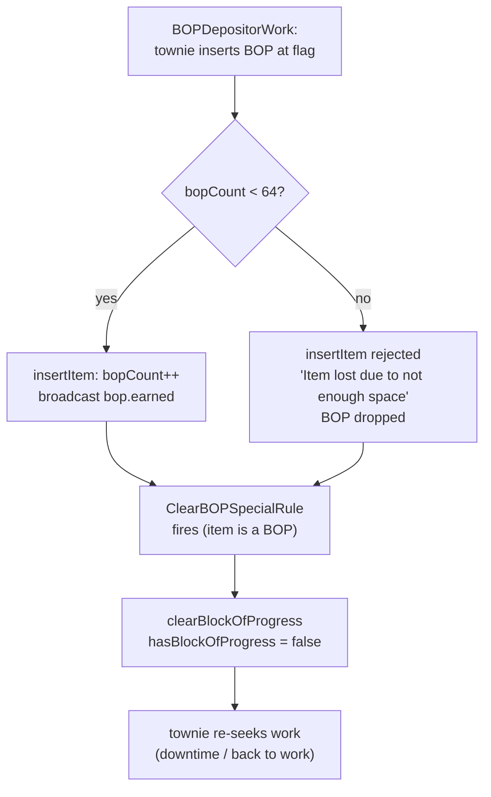
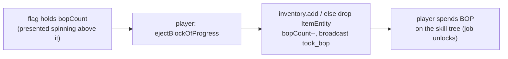

# Relocation deed — availability, collection, loss-protection

The deed is **not** dropped as an item when a town shuts down. Shutdown completion
flips a **blockstate** flag on the dormant town flag; the client draws a spinning
deed above it, and the player takes it by interacting with the flag. Placement of
the collected deed (the actual town move) is out of scope here — see
`docs/adr/0009-town-relocation-via-dormant-flag-and-reference-deed.md` and
`TownRelocation`.

## Happy path

- **Why a blockstate property, not BE data**: the flag has no client-side ticker,
  so BE fields never hydrate there. Blockstate syncs for free, and every flag
  `blockstates/*.json` uses the `""` wildcard variant, so the extra property needs
  no model changes.
- **`use()` checks the deed first**, ahead of `convertItemInHand` and the flag
  menus — a dormant flag with a deed waiting is a pickup, not a UI.
- `SpinningCube` is the block-of-progress cube math lifted out of
  `SpinningCubeLayer` (visitor render layer); both callers pass their own
  translation, scale and UV window into the same six-face draw.

## Loss-protection (dormant flag only)

- Re-issue is idempotent: a lost deed just makes a new one available on the flag.
  The deed is a *reference* (town UUID + original flag pos + dimension), so
  re-issuing can never duplicate town data.
- **Waking retracts the waiting deed.** A live town must not hand out references to
  itself, and the deed branch in `use()` would otherwise shadow the flag menu on
  every interaction from then on.
- The deed's availability rides the blockstate, so it survives chunk unload and
  never expires — losing track of a dormant town is exactly what it protects
  against.

---

# Block of Progress — the earn → deposit → collect state machine

The BOP is the town's progression currency: a townie **earns** it by leveling up,
**deposits** it into the flag, and the **player** collects and spends it on the
skill tree. The non-obvious part — and the reason this needs a map — is that the
XP **latch** clears at *deposit*, **not** at player collection. "Uncollected" is
therefore two distinct states, not one:

- **The latch** (`SimpleVillagerHandle.hasBlockOfProgress`, one `Boolean` per
  townie) — set on level-up, the value `addExperience` early-returns on; a townie
  can hold **at most one** uncollected BOP, so it accrues no XP until it deposits.
- **The flag's count** (`TownFlagBlockEntity.bopCount`, capped at **64** by
  `TownFlagBOPItemHandler.getSlots()`) — bumped on deposit, decremented only when
  the **player** collects. This is the "uncollected by the player" state.

## Earn → latch → assign (happy path)

- The latch is a `Boolean`, not a counter — one townie holds at most one BOP, so
  it stalls for the brief level-up→deposit window, **not** until the player
  collects (collection never touches the latch).
- `changeJobForVisitorFromBoard` checks `hasBlockOfProgress` **before** the
  downtime/rest checks, so a latched townie always takes the deposit over idling.

## Deposit — the 64-slot cap

- `ClearBOPSpecialRule` fires **regardless of whether the insert succeeded** — it
  only checks the item *is* a BOP. That is why a full flag **does not re-stall**
  the townie: the latch clears even when the deposit is rejected, so the townie
  returns to work and can level again.
- The flag caps at **64**; past that, excess BOPs are silently dropped
  (server-logged `Item lost …`, not player-visible). A left-alone town therefore
  does not freeze — townies keep working, BOPs pile to 64, then further ones are
  lost. "Stops progressing" = the skill tree doesn't advance, not townies freezing.
- Verified by `flag/bop_boundary_63` (63→64 accepted, latch cleared) and
  `flag/bop_full_64` (64→full rejected, latch *still* cleared).

## Collect + spend (player side)

- Collection is the **only** thing that moves `bopCount` down; it never touches the
  latch. Spending is the player's decision, so progression advances only if the
  player checks in — the counterweight to warp (ADR-0011).
