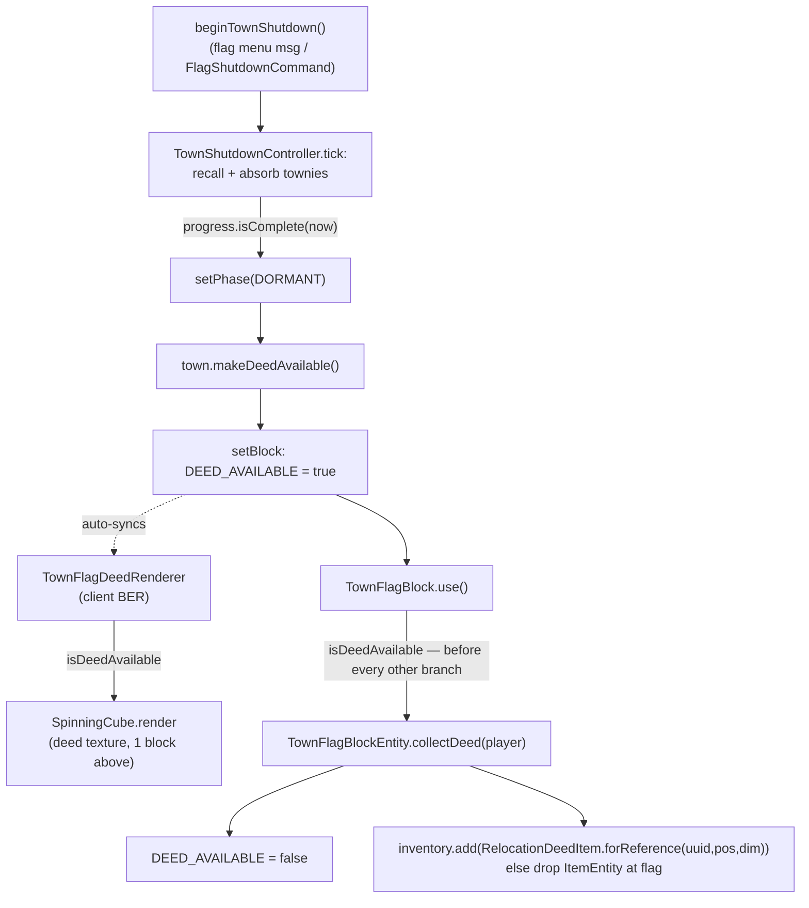
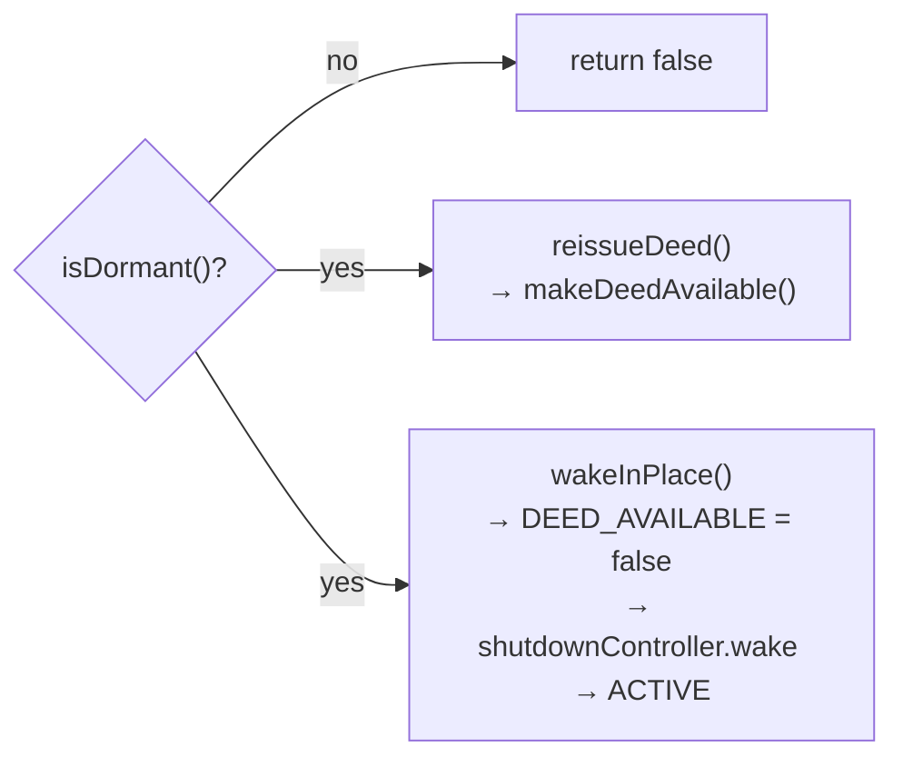

# Relocation deed — availability, collection, loss-protection

The deed is **not** dropped as an item when a town shuts down. Shutdown completion
flips a **blockstate** flag on the dormant town flag; the client draws a spinning
deed above it, and the player takes it by interacting with the flag. Placement of
the collected deed (the actual town move) is out of scope here — see
`docs/adr/0009-town-relocation-via-dormant-flag-and-reference-deed.md` and
`TownRelocation`.

## Happy path

- **Why a blockstate property, not BE data**: the flag has no client-side ticker,
  so BE fields never hydrate there. Blockstate syncs for free, and every flag
  `blockstates/*.json` uses the `""` wildcard variant, so the extra property needs
  no model changes.
- **`use()` checks the deed first**, ahead of `convertItemInHand` and the flag
  menus — a dormant flag with a deed waiting is a pickup, not a UI.
- `SpinningCube` is the block-of-progress cube math lifted out of
  `SpinningCubeLayer` (visitor render layer); both callers pass their own
  translation, scale and UV window into the same six-face draw.

## Loss-protection (dormant flag only)

- Re-issue is idempotent: a lost deed just makes a new one available on the flag.
  The deed is a *reference* (town UUID + original flag pos + dimension), so
  re-issuing can never duplicate town data.
- **Waking retracts the waiting deed.** A live town must not hand out references to
  itself, and the deed branch in `use()` would otherwise shadow the flag menu on
  every interaction from then on.
- The deed's availability rides the blockstate, so it survives chunk unload and
  never expires — losing track of a dormant town is exactly what it protects
  against.
